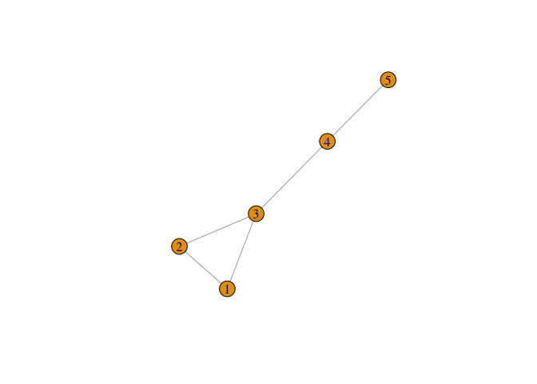
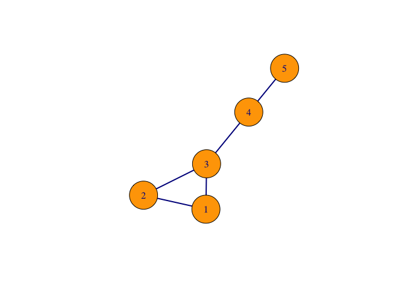
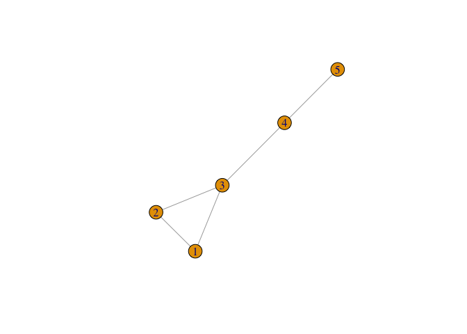
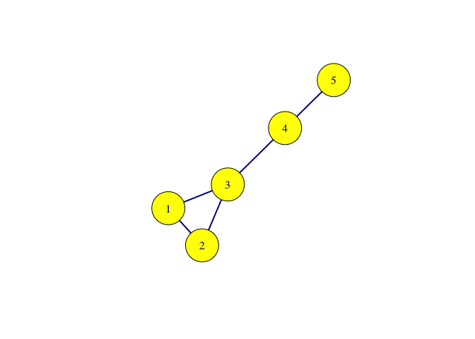

Notebook Grafos Aula 01
================

``` r
knitr::opts_chunk$set(echo = TRUE)

## Notebook Grafos Aula 01

### Bibliotecas
library(dplyr)
```

    ## 
    ## Attaching package: 'dplyr'

    ## The following objects are masked from 'package:stats':
    ## 
    ##     filter, lag

    ## The following objects are masked from 'package:base':
    ## 
    ##     intersect, setdiff, setequal, union

``` r
library(plyr)
```

    ## -------------------------------------------------------------------------

    ## You have loaded plyr after dplyr - this is likely to cause problems.
    ## If you need functions from both plyr and dplyr, please load plyr first, then dplyr:
    ## library(plyr); library(dplyr)

    ## -------------------------------------------------------------------------

    ## 
    ## Attaching package: 'plyr'

    ## The following objects are masked from 'package:dplyr':
    ## 
    ##     arrange, count, desc, failwith, id, mutate, rename, summarise,
    ##     summarize

``` r
library(igraph)
```

    ## 
    ## Attaching package: 'igraph'

    ## The following objects are masked from 'package:dplyr':
    ## 
    ##     as_data_frame, groups, union

    ## The following objects are masked from 'package:stats':
    ## 
    ##     decompose, spectrum

    ## The following object is masked from 'package:base':
    ## 
    ##     union

``` r
library(timeordered)

### Consciência situacional
setwd('/Users/sidneibarbieri/Documents/Grafos/IntroGrafos/')
getwd()
```

    ## [1] "/Users/sidneibarbieri/Documents/Grafos/IntroGrafos"

``` r
g1 = read_graph("./G1.net", format = c("pajek"))
g1
```

    ## IGRAPH 909aae0 UNW- 5 5 -- 
    ## + attr: id (v/c), name (v/c), weight (e/n)
    ## + edges from 909aae0 (vertex names):
    ## [1] 1--2 1--3 2--3 3--4 4--5

``` r
g2 <- graph( edges = c(1,2, 
                       1,3, 
                       2,3, 
                       3,4, 
                       4,5), n=5, directed=F)
plot(g2)
```



``` r
plot(g2, vertex.size=40, vertex.color="orange", edge.color="darkblue", edge.width=2, vertex.label.font=5)
```



``` r
### Plotar o Grafo G1
plot(g1)
```



``` r
plot(g1, vertex.size=40, vertex.color="orange", edge.color="darkblue", edge.width=2, vertex.label.font=5)
```


``` r
names = V(g1)$id
names
```

    ## [1] "1" "2" "3" "4" "5"

``` r
plot(g1, vertex.label=names, 
     vertex.size=40, 
     vertex.color="yellow", 
     edge.color="darkblue", 
     edge.width=2, 
     vertex.label.font=5)

### Listar Vértices
V(g1)
```

    ## + 5/5 vertices, named, from 909aae0:
    ## [1] 1 2 3 4 5

``` r
V(g2)
```

    ## + 5/5 vertices, from e319d1e:
    ## [1] 1 2 3 4 5

``` r
###Nomes dos Vérices
V(g1)$name
```

    ## [1] "1" "2" "3" "4" "5"

``` r
vertex_attr(g1)
```

    ## $id
    ## [1] "1" "2" "3" "4" "5"
    ## 
    ## $name
    ## [1] "1" "2" "3" "4" "5"

``` r
V(g2)$name
```

    ## NULL

``` r
V(g2)$name <- c("1", "2", "3", "4", "5")
vertex_attr(g2)
```

    ## $name
    ## [1] "1" "2" "3" "4" "5"

``` r
### Listar Arestas
E(g1)
```

    ## + 5/5 edges from 909aae0 (vertex names):
    ## [1] 1--2 1--3 2--3 3--4 4--5

``` r
#### Peso das Arestas
E(g1)$weight
```

    ## [1] 1 1 1 1 1

``` r
edge_attr(g2)
```

    ## list()

``` r
E(g2)$weight <- 1
edge_attr(g2)
```

    ## $weight
    ## [1] 1 1 1 1 1

``` r
### Matriz de Incidências
g1[]
```



    ## 5 x 5 sparse Matrix of class "dgCMatrix"
    ##   1 2 3 4 5
    ## 1 . 1 1 . .
    ## 2 1 . 1 . .
    ## 3 1 1 . 1 .
    ## 4 . . 1 . 1
    ## 5 . . . 1 .

``` r
### Conexões de um Vértice
#### Vértice 1
g1[1,]
```

    ## 1 2 3 4 5 
    ## 0 1 1 0 0

``` r
#### Vértice 5
g1[5,]
```

    ## 1 2 3 4 5 
    ## 0 0 0 1 0

``` r
### Distribuição de Graus
d1 = degree.distribution(g1, cumulative=FALSE)
len = length(d1)

png(filename="G1_graus.png", height=500, width=500, bg="white")
barplot(d1, main="Distribuição de Graus", xlab="Graus", ylab="PDF", names.arg=c(0:(len-1)))

dev.off()
```

    ## quartz_off_screen 
    ##                 2

``` r
### Proximidade dos Vértices
cl = closeness(g1)
cl
```

    ##         1         2         3         4         5 
    ## 0.1428571 0.1428571 0.2000000 0.1666667 0.1111111

``` r
### Vértice com maior grau
cl_max= max(cl)
cl_max
```

    ## [1] 0.2

``` r
vindex_max = which(closeness(g1) == cl_max)
vindex_max
```

    ## 3 
    ## 3

``` r
vmax=V(g1)[vindex_max]$id
vmax
```

    ## [1] "3"

``` r
### Vértice com menor grau
cl_min= min(cl)
cl_min
```

    ## [1] 0.1111111

``` r
vindex_min = which(closeness(g1) == cl_min)
vindex_min
```

    ## 5 
    ## 5

``` r
vmin=V(g1)[vindex_min]$id
vmin
```

    ## [1] "5"

``` r
### Máxima distância mínima entre Vértices
b = betweenness(g1)
bmax=max(b)
bmax
```

    ## [1] 4

``` r
bindex_max = which(betweenness(g1) == bmax)
bindex_max
```

    ## 3 
    ## 3

``` r
bmax=V(g1)[bindex_max]$id
bmax
```

    ## [1] "3"

``` r
bmin= min(b)
bmin
```

    ## [1] 0

``` r
bindex_min = which(betweenness(g1) == bmin)
bindex_min
```

    ## 1 2 5 
    ## 1 2 5

``` r
bmin=V(g1)[bindex_min]$id
bmin
```

    ## [1] "1" "2" "5"

``` r
### Arestas
vcount(g1)
```

    ## [1] 5

``` r
ecount(g1)
```

    ## [1] 5

``` r
E(g1)
```

    ## + 5/5 edges from 909aae0 (vertex names):
    ## [1] 1--2 1--3 2--3 3--4 4--5

``` r
eb = edge.betweenness(g1)
eb
```

    ## [1] 1 3 3 6 4

``` r
### Caminho mais curto
distances(g1)
```

    ##   1 2 3 4 5
    ## 1 0 1 1 2 3
    ## 2 1 0 1 2 3
    ## 3 1 1 0 1 2
    ## 4 2 2 1 0 1
    ## 5 3 3 2 1 0

``` r
coreness(g1, mode="all")
```

    ## 1 2 3 4 5 
    ## 2 2 2 1 1

``` r
g2 <- simplify(g2, remove.multiple = F, remove.loops = T)


### Lista de Arestas
as_edgelist(g2, names=T)
```

    ##      [,1] [,2]
    ## [1,] "1"  "2" 
    ## [2,] "1"  "3" 
    ## [3,] "2"  "3" 
    ## [4,] "3"  "4" 
    ## [5,] "4"  "5"

``` r
### Matriz de Adjacências 
madj <- as_adjacency_matrix(g2, attr="weight")


### Matriz de Caminhos Mínimos
distances(g1)
```

    ##   1 2 3 4 5
    ## 1 0 1 1 2 3
    ## 2 1 0 1 2 3
    ## 3 1 1 0 1 2
    ## 4 2 2 1 0 1
    ## 5 3 3 2 1 0

``` r
### Grau dos Vértices
degree(g2)
```

    ## 1 2 3 4 5 
    ## 2 2 3 2 1

``` r
grau <- degree(g2)
as.data.frame(grau)
```

    ##   grau
    ## 1    2
    ## 2    2
    ## 3    3
    ## 4    2
    ## 5    1

``` r
V(g2)$grau <- 0
gr1 <- sum(madj[,1])
gr2 <- sum(madj[,2])
gr3 <- sum(madj[,3])
gr4 <- sum(madj[,4])
gr5 <- sum(madj[,5])

V(g2)$grau <- c(gr1, gr2, gr3, gr4, gr5)
V(g2)$grau
```

    ## [1] 2 2 3 2 1

``` r
### Coeficiente de aglomeração
V(g2)$coef <- c(0, 0, 0, 0, 0)
V(g2)$coef <- as.double(V(g2)$coef)

c1 = 2*1/gr1*(gr1-1)
c2 = 2*1/gr2*(gr2-1)
c3 = 2*1/gr3*(gr3-1)
c4 = 2*0/gr4*(gr4-1)
c5 = 2*0/gr5*(gr5-1)

V(g2)$coef <- as.double(c(c1, c2, c3, c4, c5))

V(g2)$coef
```

    ## [1] 1.000000 1.000000 1.333333 0.000000 0.000000

``` r
### Mínimo caminho médio
mcm <- distances(g1)
mcm <- as.data.frame(mcm)

l1 <- sum(mcm[1,])/(5-1)
l2 <- sum(mcm[2,])/(5-1)
l3 <- sum(mcm[3,])/(5-1)
l4 <- sum(mcm[4,])/(5-1)
l5 <- sum(mcm[5,])/(5-1)

average.path.length(g2, directed = FALSE)
```

    ## [1] 1.7

``` r
### Diâmetro
diameter(g2)
```

    ## [1] 3
